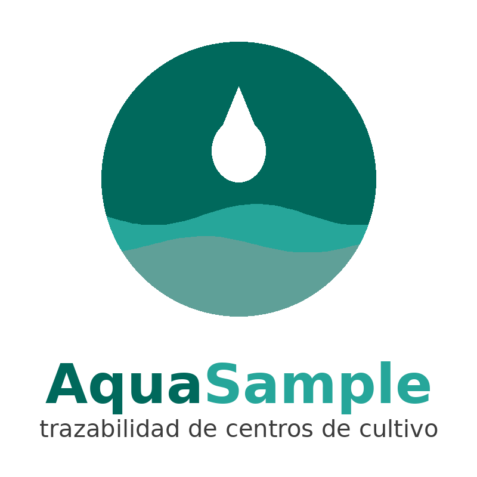
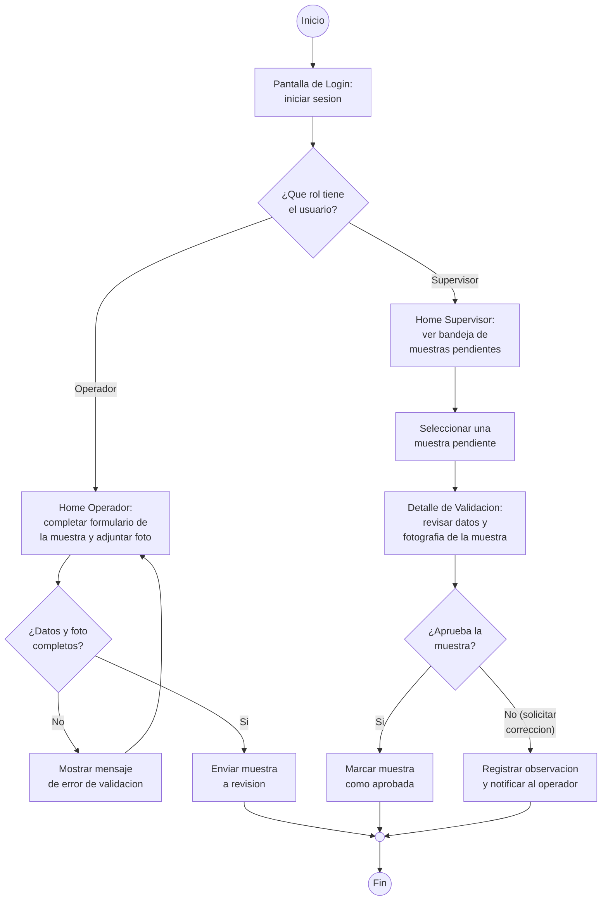

# AquaSample

Aplicación móvil para registrar y validar muestras de terreno en Aldemar SpA, con dos roles: **Operador de Muestreo** y **Supervisor Técnico** (MVP académico — DSY1105, La Brigada Fantasma 01).

## Identidad visual

| Color | HEX | Uso |
|---|---|---|
| Principal | `#00695C` | TopAppBar, botones principales, iconos activos |
| Secundario | `#26A69A` | Acentos, tarjetas de listado |
| Fondo | `#F4FAF9` | Fondo general de las pantallas |
| Texto | `#1B1B1B` | Texto principal |
| Adicional | `#FFB300` | Alertas y estado "pendiente" en la bandeja |

## Flujo de usuario (Diagrama de Actividad UML)

## Pantallas principales

Ver diseños en `docs/diseno/interfaces/`:

- Pantalla de Login — `wireframe_1_login.png`
- Home Operador — `wireframe_2_home_operador.png`
- Home Supervisor — `wireframe_3_home_supervisor.png`
- Detalle de Validación — `wireframe_4_detalle_validacion.png`

> Interfaces generadas con Stitch IA y ajustadas por el equipo a la paleta de AquaSample.

## Integrantes

| Nombre | Rol |
|---|---|
| Javier Cataldo | Líder de Proyecto y Repositorio (Team Lead) |
| Cristobal Gonzalez | Desarrollador Core y Lógica (Backend) |
| Vicente Barrera | Analista de Calidad y Validaciones (QA Tester) |
| Daniel Vargas | Desarrollador de Interfaz y Flujos (Frontend / UI) |

## Tecnologías

Kotlin · Jetpack Compose · corrutinas.
