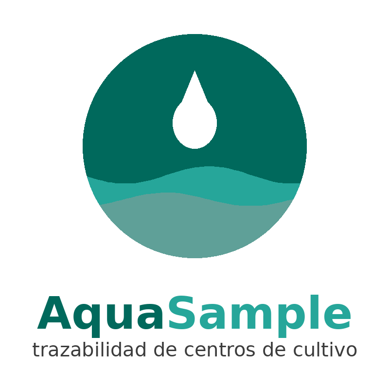
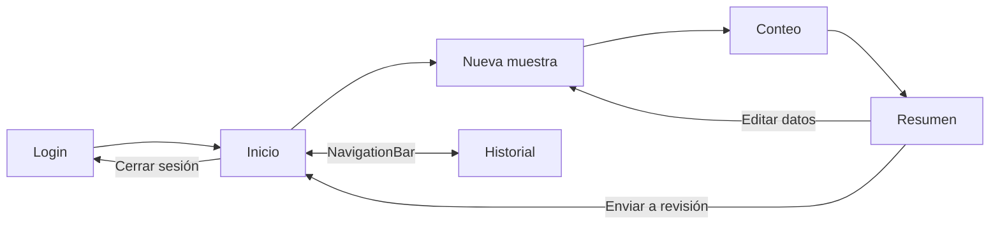
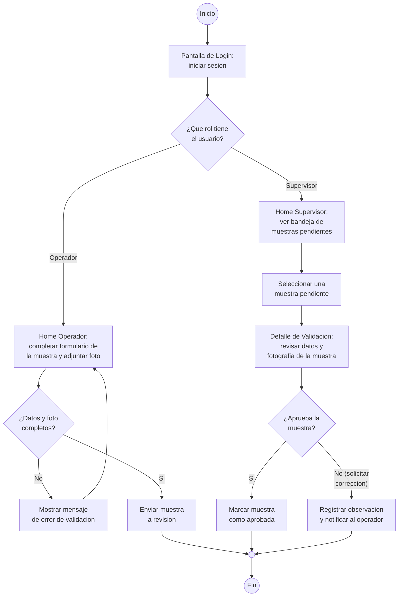

# AquaSample

Aplicación móvil para registrar y validar muestras de terreno en Aldemar SpA, con dos roles: **Operador de Muestreo** y **Supervisor Técnico** (MVP académico — DSY1105, La Brigada Fantasma).

## Problema que aborda

En el muestreo de líneas de cultivo de choritos, el conteo y el registro se hacen de forma manual. Con alta densidad de individuos el proceso es lento y aparecen diferencias de conteo y registros incompletos. Además, los datos, las fotografías y las notas quedan repartidos en archivos distintos, lo que dificulta revisar, corregir y comparar el historial de una misma línea.

AquaSample permite registrar cada muestra con sus datos de trazabilidad (centro, tren, línea, fecha, hora y tramo), su conteo y sus observaciones, y consultar el historial de muestras con su estado de revisión.

> MVP académico: todos los usuarios, centros y muestras son **ficticios**. No se usa información real de ALDEMAR.

## Integrantes

| Nombre | Rol |
|---|---|
| Javier Cataldo | Líder de Proyecto y Repositorio (Team Lead) |
| Cristobal Gonzalez | Desarrollador Core y Lógica (Backend) |
| Vicente Barrera | Analista de Calidad y Validaciones (QA Tester) |
| Daniel Vargas | Desarrollador de Interfaz y Flujos (Frontend / UI) |

## Identidad visual



| Color | HEX | Uso |
|---|---|---|
| Principal | `#00695C` | TopAppBar, botones principales, iconos activos |
| Secundario | `#26A69A` | Acentos, tarjetas de listado |
| Fondo | `#F4FAF9` | Fondo general de las pantallas |
| Texto | `#1B1B1B` | Texto principal |
| Adicional | `#FFB300` | Alertas y estado "pendiente" en la bandeja |

La paleta está aplicada en el tema de la app (`ui/theme/Color.kt` y `ui/theme/Theme.kt`), con versión para modo oscuro. El color dinámico de Android 12+ está desactivado para que la app mantenga siempre esta identidad.

## Arquitectura: MVVM

```
app/src/main/java/com/example/aquasample/
├── MainActivity.kt          → aplica el tema y carga AquaSampleApp
├── model/                   → entidades de datos
├── data/                    → datos ficticios y repositorio en memoria
├── viewmodel/               → ViewModels y estado de las pantallas (StateFlow)
└── ui/
    ├── navigation/          → Rutas y NavHost (AppNavegacion)
    ├── screens/             → una pantalla por archivo
    ├── components/          → componentes reutilizables
    └── theme/               → colores, tipografía y tema Material 3
```

- **Model:** clases de datos sin lógica de pantalla.
- **ViewModel:** guarda el estado (`UiState` + `StateFlow`), valida los campos y llama al repositorio.
- **View (Compose):** las pantallas observan el estado con `collectAsState()` y envían las acciones del usuario al ViewModel.
- **Repository:** `MuestraRepository` guarda las muestras en memoria mientras la app está abierta. Más adelante puede cambiarse por Room sin tocar las pantallas.

### Modelos principales (`model/`)

| Modelo | Descripción |
|---|---|
| `Usuario` | Usuario ficticio con nombre, usuario, clave y rol |
| `Rol` | `OPERADOR` o `SUPERVISOR` |
| `Centro` | Centro de cultivo |
| `Tren` | Tren de cultivo, pertenece a un centro |
| `Linea` | Línea de cultivo, pertenece a un tren |
| `Muestra` | Centro, tren, línea, fecha, hora, tramo, operador, conteo, observaciones y estado |
| `Conteo` | Cantidad de individuos y calibre promedio (opcional) |
| `EstadoRevision` | `PENDIENTE`, `OBSERVADO`, `CORREGIDO` o `VALIDADO` |

### ViewModels (`viewmodel/`)

| ViewModel | Pantallas | Responsabilidad |
|---|---|---|
| `LoginViewModel` | Login | Valida usuario y clave ficticios y guarda el usuario de la sesión |
| `MuestraViewModel` | Nueva muestra, Conteo, Resumen, Inicio | Formulario compartido de la muestra, validaciones y envío a revisión |
| `HistorialViewModel` | Historial | Filtra las muestras por centro, línea y estado de revisión |

## Pantallas implementadas

| Pantalla | Archivo | Qué hace |
|---|---|---|
| Login | `LoginScreen.kt` | Ingreso con usuarios ficticios; el rol se detecta según el usuario |
| Inicio | `InicioScreen.kt` | Saludo, botón "Registrar nueva muestra" (operador) y lista de muestras |
| Nueva muestra | `NuevaMuestraScreen.kt` | Centro, tren, línea, fecha, hora, tramo y observaciones, con validación |
| Conteo | `ConteoScreen.kt` | Conteo de individuos con botones +/− y calibre opcional |
| Resumen | `ResumenScreen.kt` | Revisión de los datos y envío de la muestra a revisión |
| Historial | `HistorialScreen.kt` | Historial de muestras con filtros por centro, línea y estado |

Componentes Material 3 utilizados: `Scaffold`, `TopAppBar`, `NavigationBar`, `Card`, `Button`, `OutlinedButton`, `TextButton`, `IconButton`, `OutlinedTextField`, `DropdownMenu`, `FilterChip` y `Text`.

### Usuarios de prueba

| Usuario | Clave | Rol |
|---|---|---|
| `operador1` | `1234` | Operador de muestreo |
| `operador2` | `1234` | Operador de muestreo |
| `supervisor1` | `1234` | Supervisor técnico |

La app incluye 5 muestras ficticias de ejemplo con distintos estados de revisión, para que Inicio e Historial muestren datos desde el primer ingreso.

## Flujo de navegación actual

Implementado con **Navigation Compose** (`NavController` + `NavHost`, rutas en `ui/navigation/Rutas.kt`):


```mermaid
flowchart LR
    login["Login"] --> inicio["Inicio"]
    inicio --> nueva["Nueva muestra"]
    nueva --> conteo["Conteo"]
    conteo --> resumen["Resumen"]
    resumen -->|"Enviar a revisión"| inicio
    resumen -->|"Editar datos"| nueva
    inicio <-->|"NavigationBar"| historial["Historial"]
    inicio -->|"Cerrar sesión"| login
```

- **NavigationBar del operador:** Inicio · Nueva muestra · Historial.
- **NavigationBar del supervisor:** Inicio · Historial.
- Desde Conteo y Resumen se puede volver con el botón de la TopAppBar o con el botón "atrás" del teléfono.
- Si faltan campos obligatorios, la app no avanza y muestra el error debajo del campo.

## Flujo de usuario diseñado (Diagrama de Actividad UML — Clase 2)


```mermaid
flowchart TD
    start(("Inicio")) --> login["Pantalla de Login:<br/>iniciar sesion"]
    login --> dec1{"¿Que rol tiene<br/>el usuario?"}

    dec1 -->|Operador| formOp["Home Operador:<br/>completar formulario de<br/>la muestra y adjuntar foto"]
    formOp --> dec2{"¿Datos y foto<br/>completos?"}
    dec2 -->|No| errOp["Mostrar mensaje<br/>de error de validacion"]
    errOp --> formOp
    dec2 -->|Si| enviar["Enviar muestra<br/>a revision"]
    enviar --> merge((" "))

    dec1 -->|Supervisor| bandeja["Home Supervisor:<br/>ver bandeja de<br/>muestras pendientes"]
    bandeja --> seleccionar["Seleccionar una<br/>muestra pendiente"]
    seleccionar --> detalle["Detalle de Validacion:<br/>revisar datos y<br/>fotografia de la muestra"]
    detalle --> dec3{"¿Aprueba la<br/>muestra?"}
    dec3 -->|Si| aprobar["Marcar muestra<br/>como aprobada"]
    aprobar --> merge
    dec3 -->|"No (solicitar<br/>correccion)"| corregir["Registrar observacion<br/>y notificar al operador"]
    corregir --> merge

    merge --> stop(("Fin"))
```

> La fotografía y la pantalla de detalle/validación del supervisor forman parte del diseño, pero aún no están implementadas en esta etapa.

### Wireframes

Ver diseños en `docs/diseno/interfaces/`:

- Pantalla de Login — `wireframe_1_login.png`
- Home Operador — `wireframe_2_home_operador.png`
- Home Supervisor — `wireframe_3_home_supervisor.png`
- Detalle de Validación — `wireframe_4_detalle_validacion.png`

> Interfaces generadas con Stitch IA y ajustadas por el equipo a la paleta de AquaSample.

## Capturas de la aplicación

> Pendiente: agregar en `docs/capturas/` las capturas del recorrido Login → Inicio → Nueva muestra → Conteo → Resumen → Historial.

## Avance por rama

| Rama | Responsable | Contenido |
|---|---|---|
| `feature/modelos-viewmodel` | Cristobal Gonzalez | Modelos, datos ficticios, `MuestraRepository`, `LoginViewModel` y `MuestraViewModel` |
| `feature/pantallas-navegacion` | Daniel Vargas | Pantallas Login, Inicio, Nueva muestra, Conteo y Resumen; NavHost, TopAppBar y NavigationBar |
| `feature/historial` | Vicente Barrera | Paleta de colores del equipo en el tema, muestras ficticias de ejemplo, pantalla Historial con filtros y `HistorialViewModel`; actualización del README |

## Fuera del alcance de esta etapa

Room / DataStore, API REST, cámara o galería, conteo automático por imágenes, autenticación real e integración con sistemas de ALDEMAR.

## Tecnologías

Kotlin · Jetpack Compose · Material Design 3 · Arquitectura MVVM · Navigation Compose · StateFlow y corrutinas.
